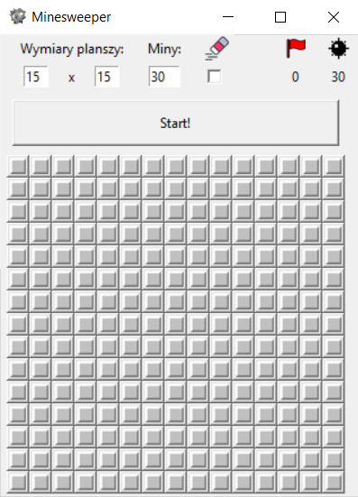

# **Minesweeper**

Minesweeper is a classic single-player video game, whose objective is to clear a rectangular board containing “mines” without detonating any of them, thanks to clues about the number of mines in neighboring fields.

### Technologies

- Python 3.9
- Tkinter

## Setup

To run the game, simply install it with the [executable file](Minesweeper.exe)

## Game

The player can decide for himself how big the game board should be (0> n, m > 15), as well as the number of mines (from 0 to n*m).

The player can click the hidden field with a left mouse button to unveil it, or with right mouse button to mark it with a flag.
Unveiling the flagged field with left-click is not possible. 
The player can right-click the flagged field to mark it with a question mark, leaving a message to himself that later he will need to check a possibility of mine being at this field once he gathers more informations.

Unveiling the mine ends the game in Defeat.

Unveiling all fields not containing the mines or marking all mines with flags ends the game in Victory.

## Xyzzy

'Xyzzy' is a cheat code, which - after being written by player - turns all fields with mines to the grey ones.

